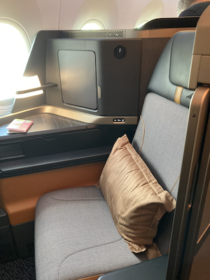

在愛麗絲夢遊仙境中有一段對話

「這裡是哪裡？」愛麗絲問。

「你要去哪裡？」精靈回答。

「我不知道。」

「如果你不知道你要去哪裡，那麼現在你在哪裡一點都不重要。」

人生沒有目標，你也不會知道你要去哪裡

每天就這樣得過且過，不知不覺人生10年20年過去，回頭發現自己好像沒有留下什麼？

我相信你會有這樣的困繞，因為我也是
每天上班、下班，週末跟朋友聚餐，出門跨年狂歡，然後新年，過節又跨年
驀然回首，自己，好像就這樣一年一年過，對未來也沒有太大的想法

有天，看了蕾咪「小資族下班後翻倍賺：財富自由GET」這本書，她提到說她身邊的朋友總是認為他是人生勝利組，她在書中提到她覺得可能是因為人生清單幫助她創造幸運。
有錢又有運，當然我也想要試試

### 那就開始吧!! ###

於是，我打開我的電子筆記OneNote，建立新的頁面，思考那些我想做、我想去的、我想體驗的
就這樣洋洋灑灑列了一堆

因為每年都會做年度計畫，一開始以為不會太難，但發現列到了第50個後，就有點卡住了

恩～卡住了，怎辦??
不怎麼辦，你可以繼續耍廢放懶…

但請記得，每隔一陣子，或者沮喪或者難過或者開心或者……
就請打開它。
相信我，當你在徬徨無奈時，看到你自己的夢想清單，就突然會有股要往前的動力

### 只為了自己 ###

列出了清單，每當接觸到有趣的事物我都會把他列出夢想清單
例如看到YT去美國NASA總部，我覺得好酷！ 於是寫下我要去NASA總部
但寫完後，我看著它，心裡頓時有個聲音問我

「你真的想去NASA總部嗎？」

是的，事實上，我並沒有這麼想去NASA總部。

我對外太空沒有夢，我對北斗七星也是一知半解

NASA總部發射火箭我可能會選擇追劇而不是追直播

那，為何我要去NASA總部？

於是，我把這條從我的人生清單刪除，Forever!

請記得，詢問你的心，列出你真正想要像做的，不是別人眼中風光美好的

### 搭配你的行動 ###

寫下清單後，我三不五時都會打開看一下，讓我有股動力往前

也讓我在作規劃上，會試著配合我的夢想清單行動

例如我想要體驗星宇航空的商務艙，我開始研究星宇航空的航線

就在我今年五月去東京玩時，因為知道我有星宇商務艙這個夢想，所以在買機票時就挑選星宇

也就這樣我的人生夢想清單開心的劃掉一個

又例如去美國拉斯維加斯遊玩是我的夢想之一，我知道這個夢想需要一筆不小的旅費支出

為了實現我這個夢，我在我的Richart帳戶建立了兩個夢想罐：A380頭等艙跟拉斯維加斯遊玩，然後每個月固定從薪資中轉些許金額過去慢慢累加

每次看到帳戶備注"A380頭等艙入帳xxxx元"，心裡就有種莫名的爽快

幻想著或許幾年後我就可以搭乘A380頭等艙去拉斯維加斯賭一把！

### 建立夢想清單相簿 ###

有了夢想，於是你會開始想像

開始幻想真的達到了哪種無法影藏喜悅

為了加深我們的想像，可以開始在你的點子筆記本上，你的夢想清單的下一頁，建立一個夢想相簿

把那些你可以想像的預期的景色，全都一一貼上

以我為例

我在Goole上搜尋了「阿聯酋A380頭等艙」

跑出很多一一體驗A380頭等艙的開箱文

我把這些照片一一存下，想像有一天我搭上頭等艙那種愉悅

我會坐在這樣漂亮舒適的椅子上，享受美味的餐點。

喔～～或許我還可以在空中洗個澡，讓我下飛機時可以神清氣爽

### 結語 ###

說到這，你是不是有點心動有點想？

那，行動吧！！

打開你的筆記本，開始寫下你的夢想清單吧！
